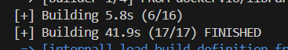
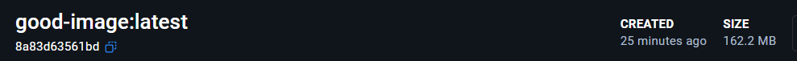

# Лабораторная №1

## Часть 1

Использовались "Best practices" из следующих источников:
- https://docs.docker.com/build/building/best-practices
- https://habr.com/ru/companies/domclick/articles/546922/
- https://github.com/hadolint/hadolint
- Несветская беседа с парой нейронок

Ознакомившись с паттернами, появилось желание ~~запихнуть~~ включить в один Dockerfile как можно больше из них, чтобы при этом они имели хоть какой-то смысл и были не для галочки. 

### Приложение 
В качестве приложения использовался учебный пример с [docker-curriculum](https://docker-curriculum.com/#our-first-image), переписанный нейронкой с python на компилируемый Go, который должен показывать случайную гифку с котиком на локалхосте

### "Плохой" Dockerfile


На всякий случай, для чистоты эксперимента, очищаем кэш:


### "Хороший" Dockerfile

Здесь вывод более объемный, поэтому вставим только время сборки






Можем заметить, что разница колоссальная. За счёт чего же удалось этого достичь?

### Best Dockerfile practices
---

Немного отклоняясь от задания, буду сразу формулировать как good practices.

#### 1. Многоступенчатая сборка

BAD
```
FROM golang:latest
```

GOOD
```
FROM golang:1.21-bullseye AS builder
...

FROM debian:bullseye-slim
COPY --from=builder /app/cat-app .
```

Позволяет значительно сократить используемое место, так как мы не тащим в итоговый контейнер инструменты сборки, ненужные системные утилиты, а берем только скомпилированный бинарник.

#### 2. Подходящие базовые образы

BAD 
```
FROM golang:latest
```

GOOD
```
FROM debian:bullseye-slim
```

Если бы в этом окошке можно было выделить **slim**, я бы его выделил, а так просто попрошу обратить на него внимание. 

Часто для работы контейнера достаточно довольно урезанной версии базового образа. Отказ от лишнего позволяет сократить размер и уменьшить площадь атаки, ведь чем меньше кода, тем меньше потенциальных уязвимостей. (Тут из-за многоступенчатой сборки пришлось сравнивать разные базовые образы, тем не менее).

#### 3. Указание конкретной версии

BAD 
```
FROM golang:latest

RUN apt install -y fortune-mod
```

GOOD
```
FROM golang:1.21-bullseye

RUN apt-get install -y figlet=2.2.* 
```

Если указать **latest** у базового образа и не указывать версию у пакетов, то скачаются самые актуальные их них. Это может в будущем, при выходе обновлений, привести к конфликтам, если не будет поддерживаться обратная совместимость.

С другой стороны при слишком жесткой фиксации можно пропустить важные фиксы и обновления безопасности. 

Поэтому, как я понял, на практике используют компромисс - фиксируют только мажорную версию, а минорные обновления и патчи берутся самые актуальные.

Либо как-то настроить Docker Scout, чтобы он нас уведомлял, что вышло обновление.


#### 4. Контекст сборки и dockerignore


BAD 
```
COPY . .
```

GOOD
```
COPY app.go .
```

В пределах Dockerfile нужно следить, что мы копируем в рабочую директорию, чтобы, опять же, уменьшить размер и не скопировать случайно чувствительные данные, оин могут обидеться. Мы, допустим, избежали добавления самих Dockerfiles в образ

За пределами Dockerfile конечно лучше использовать Dockerignore, либо передавать в *docker build* не ".", а только поддиректорию с необходимым для сборки.


#### 5. Rootless контейнеры

BAD 
```
```

GOOD
```
RUN useradd -r catuser

RUN chown catuser:catuser cat-app
USER catuser
```

Так мы значительно уменьшили вероятность получить доступ к нашим секретным ссылкам с котиками, сломать приложение и выйти за пределы контейнера на хост машину.


#### 6. Порядок слоев

BAD 
```
COPY . .

RUN apt update
RUN apt install -y figlet
RUN apt install -y fortune-mod fortunes
```

GOOD
```
RUN apt-get update && apt-get install -y --no-install-recommends \
    figlet=2.2.* \
    fortune-mod \
    fortunes \
    && rm -rf /var/lib/apt/lists/*

COPY --from=builder /app/cat-app .
```
Слои, которые наименее вероятно будут меняться, стоит ставить в начало, чтобы можно было их не пересобирать, а взять из кэша впоследствии.


#### 7. Сортировка многострочных аргументов


BAD 
```
RUN apt install -y fortune-mod fortunes
```

GOOD
```
RUN apt-get update && apt-get install -y --no-install-recommends \
    figlet=2.2.* \
    fortune-mod \
    fortunes \
    && rm -rf /var/lib/apt/lists/*
```

Это помогает упростить поддержку, обновление списка, пул реквесты и избежать дублирования.


#### 8. Объединение apt-get update && apt-get install
BAD 
```
RUN apt update
RUN apt install -y figlet
```

GOOD
```
RUN apt-get update && apt-get install ...
```
Так как докер кэширует слои, мы можем получить устаревшии версии пакетов, разделяя эти команды


#### 9. Не использовать apt


BAD 
```
RUN apt update
RUN apt install -y figlet
```

GOOD
```
RUN apt-get update && apt-get install ...
```

apt-get считается более надежным для автономного использования.

#### 10. Использовать --no-install-recommends


BAD 
```
RUN apt install -y
```

GOOD
```
RUN apt-get install -y --no-install-recommends
```

Так мы не устанавливаем необязательные пакеты, уменьшая размер и поверхность атаки


### Bad container practices
---

#### 1. Игнорирование лимитов ресурсов

Антипаттерны:

- Не задавать лимиты/requests (в Kubernetes) или ограничения Docker.

Чем плохо: noisy neighbor, непредсказуемая деградация, вынос узла, каскадные падения.


#### 2. Неправильная работа с сетью

Антипаттерны:

- Постоянно использовать --network host “для простоты”.
- Открывать порты без необходимости.
- Смешивать внутренний и внешний трафик без сегментации.

Чем плохо: конфликты портов, сложнее изоляция, труднее безопасность и наблюдаемость.


