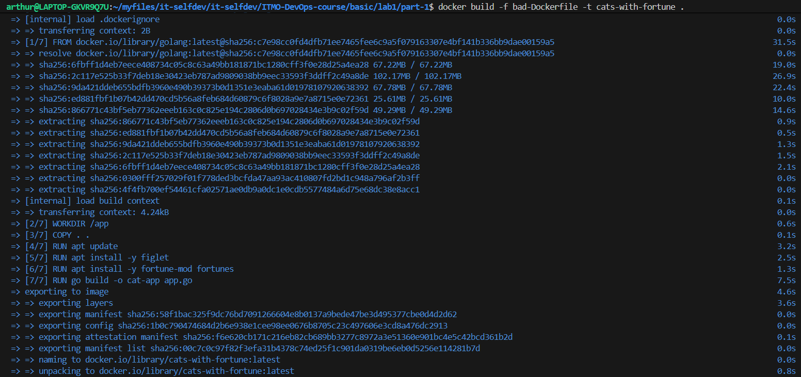
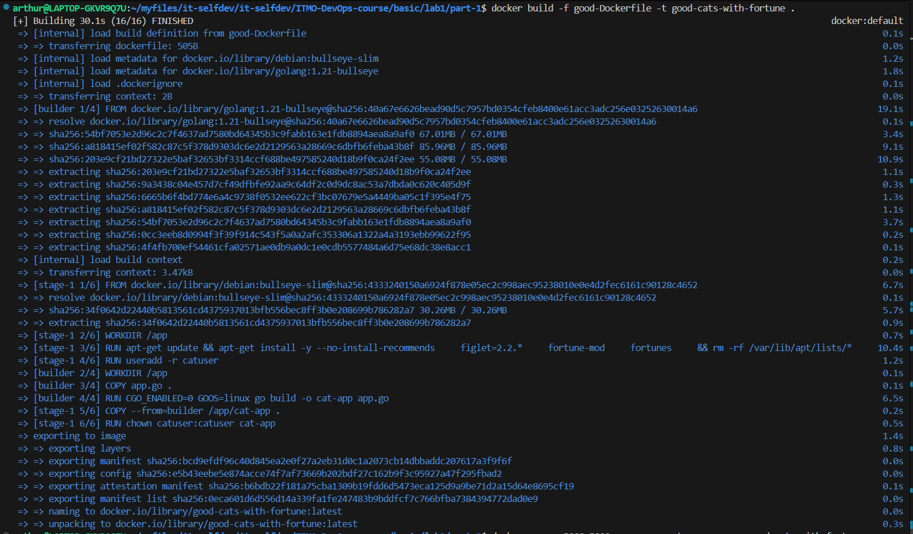

# Лабораторная №1

## Часть 1

Использовались "Best practices" из следующих источников:
- https://docs.docker.com/build/building/best-practices/#pin-base-image-versions
- https://habr.com/ru/companies/domclick/articles/546922/
- https://github.com/hadolint/hadolint
- Несветская беседа с парой нейронок

Ознакомившись с паттернами, появилось желание ~~запихнуть~~ включить в один Dockerfile как можно больше из них, чтобы при этом они имели хоть какой-то смысл и были не для галочки. 

### Приложение 
В качестве приожения использовался учебный пример с [docker-curriculum](https://docker-curriculum.com/#our-first-image), переписанный нейронкой с python на компилируемый Go, который должен показывать случайную гифку с готиком на локалхосте

### "Плохой" Dockerfile

### "Хороший" Dockerfile

### Best practices

pass