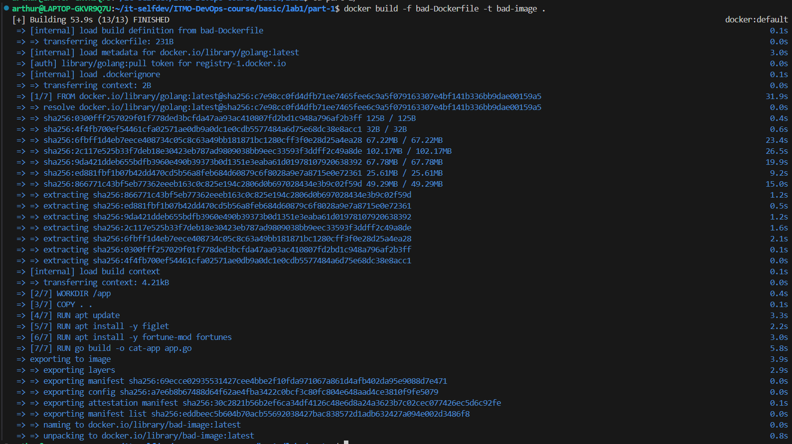
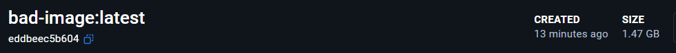
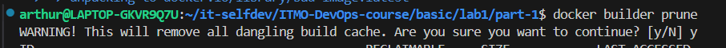

# Лабораторная №1

## Часть 1

Использовались "Best practices" из следующих источников:
- https://docs.docker.com/build/building/best-practices
- https://habr.com/ru/companies/domclick/articles/546922/
- https://github.com/hadolint/hadolint
- Несветская беседа с парой нейронок

Ознакомившись с паттернами, появилось желание ~~запихнуть~~ включить в один Dockerfile как можно больше из них, чтобы при этом они имели хоть какой-то смысл и были не для галочки. 

### Приложение 
В качестве приожения использовался учебный пример с [docker-curriculum](https://docker-curriculum.com/#our-first-image), переписанный нейронкой с python на компилируемый Go, который должен показывать случайную гифку с готиком на локалхосте

### "Плохой" Dockerfile





На всякий случай, для чистоты эксперимента, очищаем кэш:



### "Хороший" Dockerfile

Здесь вывод более объемный, поэтому вставим только время сборки


Можем заметить, что разница колоссальная. За счёт чего же удалось этого достичь?

### Best practices

Немного отклоняясь от задания, буду сразу формулировать как good practices

#### 1. Многоступенчатые сборки

BAD
```
**FROM** golang:latest
```

GOOD
```
FROM golang:1.21-bullseye AS builder
...

FROM debian:bullseye-slim
COPY --from=builder /app/cat-app .
```

Позволило значительно сократить используемое место, так как мы не тащим в итоговый контейнер инструменты сборки, ненужные системные утилиты, а берем только скомпилированный бинарник

#### 2. 