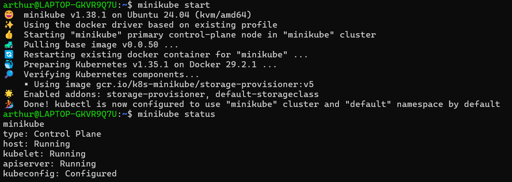
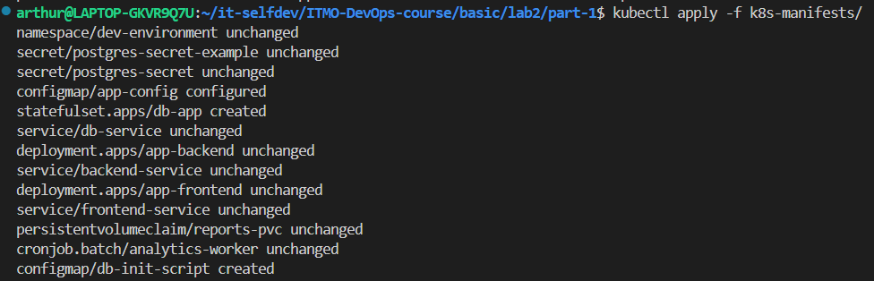
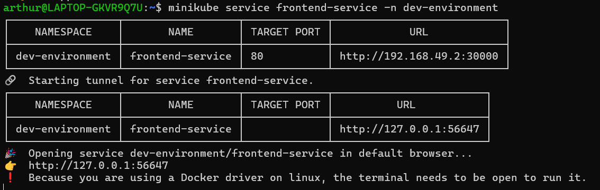
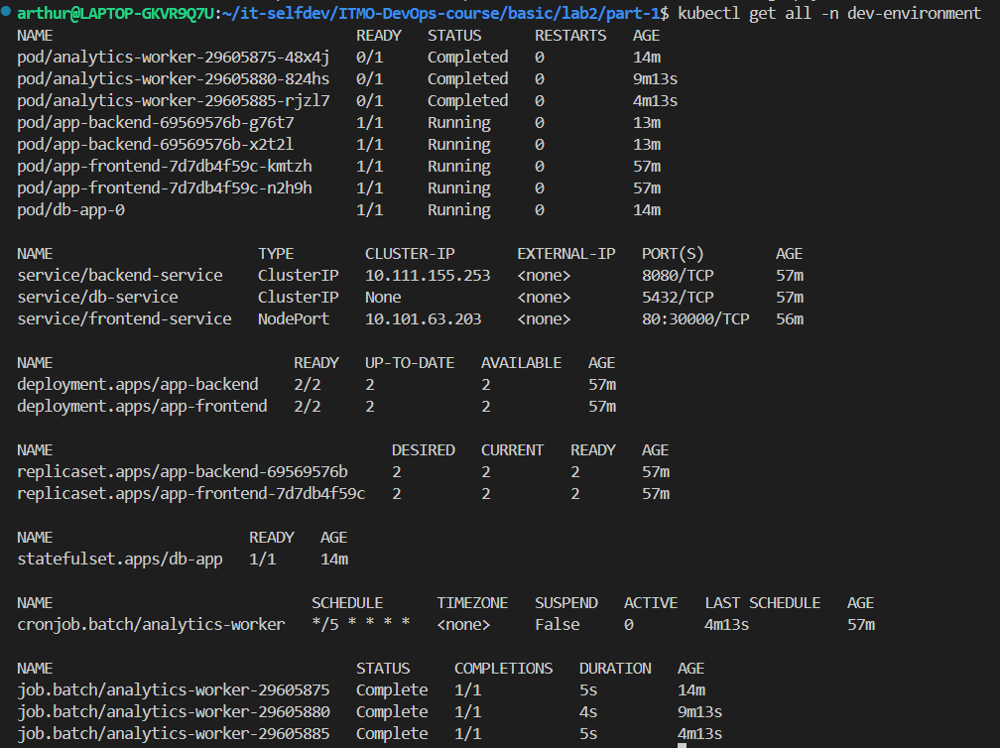
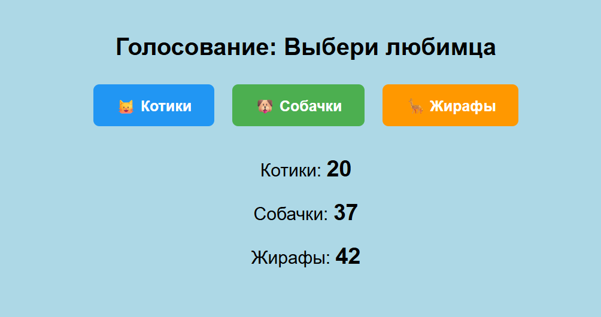
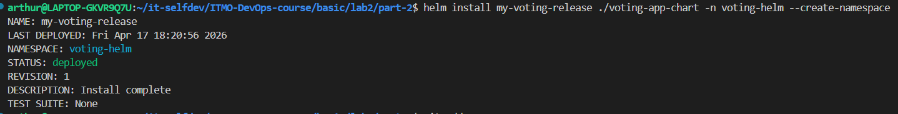
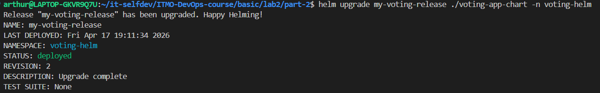
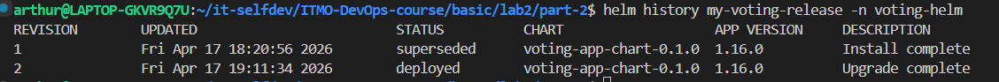

до выходных доделаю, честно 🙏

# Лабораторная №1

> Работа выполнялась на Minikube, установленный на WSL

## Часть 1

Итак, к этой лабе я тоже решил подойти проактивно и попробовать "пощупать" как можно больше базовых возможностей и абстракций кубера.

### Приложение
Для данной работы нейронкой было придумано приложение для голосования, состоящее из 4 частей: backend, frontend, bd и worker (скрипт, периодически подводящий промежуточные итоги). При чем общение с беком проходит через фронт. Такой подход поможет сфокусироваться на изучении DevOps инструментов, а не на написании кода приложения.

### Шаг 1: Контейнеризация 
Не перестаем практиковаться, для каждого компонента (части) были ручками написаны Dockerfile и .dockerignore. Также для полного теста и последующего деплоя был написан compose file.

### Шаг 2:Деплой 
Благодаря тому, что в compose.yaml мы используем атрибуты build + image, мы можем запушить необходимые образы в наш реестр командой ```docker compose push```

### Шаг 3.0: Пишем манифесты - Namespace
Для создания изолированных сред на одном узле применяются Namespaces. И, хотя их использование оправдано для разделения разных команд, групп или сообществ с разными политиками и ресурсами, почему бы не пощупать его тоже:
```yaml
apiVersion: v1
kind: Namespace
metadata:
  name: dev-environment
```

### Шаг 3.1: Secret
Для начала в кластер нужно перенести необходимые секретные данные, для чего используется сущность Secret. Файл  `db-secret.example`:
```yaml
apiVersion: v1
kind: Secret
metadata: 
  name: postgres-secret
  namespace: dev-environment
type: Opaque
data:
  DB_USER: YWRtaW4=
  DB_PASSWORD: c3VwZXJwYXNzd29yZA==
  DB_NAME: dm90aW5nX2FwcA==
```

### Шаг 3.2: ConfigMap
Используется для хранения разных переменных значений и настроек, тут всё просто:
```yaml
apiVersion: v1
kind: ConfigMap
metadata: 
  name: app-config
  namespace: dev-environment
data:
  DB_PORT: "5432"
  DB_HOST: "db-service"
  BACKGROUND_COLOR: "lightblue"
  BACKEND_URL: "http://backend-service:8080"
```

### Шаг 3.3: DB, PVC and Service
При созданиии данного манифеста я решил объеденить всё, что касается БД, чтобы не дробить логику слишком сильно. Первым идет StatefulSet, если не ошибаюсь, он полезен при созадании кластеров СУБД, а также повышает надежность данных. Здесь же создаются шалон PVC, который находит или же создают новый PV для конкретной реплики БД. Потом создаётся Headless Service, который не имеет встроенной балансировки и позволяет обращаться к каждому поду сета отдельно. Это важно если у нас есть напрмер разделеие на ReadWrite, ReadOnly etc. P.S. Впоследствии пришлось сделать явный маппинг переменых окружения
```yaml
apiVersion: apps/v1
kind: StatefulSet
metadata:
  name: db-app
  namespace: dev-environment
spec:
  serviceName: "db-service"
  replicas: 1
  selector:
    matchLabels:
      app: postgres
  template:
    metadata:
      labels:
        app: postgres
    spec:
      containers:
      - name: postgres
        image: postgres:15
        ports:
        - containerPort: 5432
        env:
          - name: POSTGRES_USER
            valueFrom:
              secretKeyRef:
                name: postgres-secret
                key: DB_USER
          - name: POSTGRES_PASSWORD
            valueFrom:
              secretKeyRef:
                name: postgres-secret
                key: DB_PASSWORD
          - name: POSTGRES_DB
            valueFrom:
              secretKeyRef:
                name: postgres-secret
                key: DB_NAME
        volumeMounts:
        - name: db-data
          mountPath: /var/lib/postgresql/data
        - name: init-script
          mountPath: /docker-entrypoint-initdb.d/init.sql
          subPath: init.sql
      
      volumes:
      - name: init-script
        configMap:
          name: db-init-script
              
  volumeClaimTemplates:
    - metadata:
        name: db-data
      spec:
        accessModes: ["ReadWriteOnce"]
        resources: 
          requests:
            storage: 1Gi

---
apiVersion: v1
kind: Service
metadata:
  name: db-service
  namespace: dev-environment
spec:
  type: ClusterIP
  clusterIP: None
  selector:
    app: postgres
  ports:
  - port: 5432
    targetPort: 5432

```


### Шаг 3.4: Backend and Service

Тут мы наконец создаём Deployment для нашего бекенда и сервис к нему, подгружем все переменные окруения.
```yaml
apiVersion: apps/v1
kind: Deployment
metadata:
  name: app-backend
  namespace: dev-environment
spec:
  replicas: 2
  selector:
    matchLabels:
      app: backend
  template:
    metadata:
      labels:
        app: backend
    spec:
      containers:
      - name: backend-pod
        image: c0demin1ster/voting-backend:v1
        ports:
        - containerPort: 8080
        envFrom:
        - secretRef:
            name: postgres-secret
        - configMapRef:
            name: app-config
          

---
apiVersion: v1
kind: Service
metadata: 
  name: backend-service
  namespace: dev-environment
spec:
  type: ClusterIP  
  selector:
    app: backend
  ports:
  - protocol: TCP
    port: 8080      
    targetPort: 8080 

```


### Шаг 3.5: Fronted and NodePort
Тут всё то же самое, с той лишь разницей что для доступа из вне тип сервиса укажем NodePort
```yaml
apiVersion: apps/v1
kind: Deployment
metadata:
  name: app-frontend
  namespace: dev-environment
spec:
  replicas: 2
  selector:
    matchLabels:
      app: frontend
  template:
    metadata:
      labels:
        app: frontend
    spec:
      containers:
      - name: frontend-pod
        image: c0demin1ster/voting-frontend:v1
        ports:
          - containerPort: 3000
        envFrom:
          - configMapRef:
              name: app-config

---
apiVersion: v1
kind: Service
metadata:
  name: frontend-service
  namespace: dev-environment
spec:
  type: NodePort
  selector:
    app: frontend
  ports:
    - protocol: TCP
      port: 80
      targetPort: 3000
      nodePort: 30000

```

### Шаг 3.6: CronJob и PVC
Тут занкомимся с CronJob, у нас будет запускать под, который каждые 5 минут будет создавать отчет.
```yaml
apiVersion: v1
kind: PersistentVolumeClaim
metadata:
  name: reports-pvc
  namespace: dev-environment
spec:
  accessModes:
    - ReadWriteOnce
  resources:
    requests:
      storage: 100Mi

---
apiVersion: batch/v1
kind: CronJob
metadata:
  name: analytics-worker
  namespace: dev-environment
spec:
  schedule: "*/5 * * * *"
  concurrencyPolicy: Forbid 
  successfulJobsHistoryLimit: 3
  
  jobTemplate:
    spec:
      template:
        spec:
          restartPolicy: OnFailure 
          containers:
          - name: worker-app
            image: c0demin1ster/voting-worker:v1
            
            envFrom:
            - secretRef:
                name: postgres-secret
            - configMapRef:
                name: app-config
            
            volumeMounts:
            - name: reports-data
              mountPath: /app/reports
          volumes:
          - name: reports-data
            persistentVolumeClaim:
              claimName: reports-pvc
```


### Шаг 3.6: фикс
Понимаем, что мы создаем пустое хранилище без БД и быстренько добавляем `db-init-configmap.yaml`
```yaml
apiVersion: v1
kind: ConfigMap
metadata:
  name: db-init-script
  namespace: dev-environment
data:
  init.sql: |
    CREATE TABLE IF NOT EXISTS votes (
        animal_type VARCHAR(50) PRIMARY KEY,
        votes_count INTEGER DEFAULT 0
    );
    INSERT INTO votes VALUES ('cats', 0), ('dogs',  0), ('giraffes', 0) ON CONFLICT (animal_type) DO NOTHING;
```

### Шаг 4: Применение манифестов и запуск
Выполняем команды
```bash
minikube start
kubectl apply -f k8s-manifests/
minikube service frontend-service -n dev-environment
```






Объекты кластера можно посмотреть командой `kubectl get all -n dev-environment`:


И всё действительно работает:



## Часть 2
### Шаг 1: Нарезка манифестов
Согласно Best Practices хелма каждое определение ресурса дожно быть в собственном шаблоне, а также содержать название этого ресурса в названии написанном dashed notation (через тире). Поэтому нужно будет разделить манифесты, которые мы ранее объеденили для удобства. Кроме того, везде следует удалить определение `namespace`

### Шаг 2: Создаем values.yaml
Записываем в файлие все атрибуты, которые мы хотим динамически изменять:
```yaml
backend:
  replicaCount: 2
  image:
    repository: c0demin1ster/voting-backend
    tag: "v1"

frontend:
  replicaCount: 2
  nodePort: 30001
  image:
    repository: c0demin1ster/voting-frontend
    tag: "v1"

database:
  storageSize: "1Gi"
```

Проверяем всё комнадой `helm template my-test-realise ./voting-app-chart`

### Шаг 3: Деплоим в кластер
Выполняем команду `helm install my-voting-release ./voting-app-chart -n voting-helm --create-namespace`, деплоя всё в тот же кластер, но в другой namespace


### Шаг 4. Апгрейдим релиз
Для теста просто обновим nodePort в values.yaml на 30050, а затем применим изменения с помощью `helm upgrade my-voting-release ./voting-app-chart -n voting-helm`



Проверяем всё командой `helm history my-voting-release -n voting-helm`



### Топ приичн испльзоать helm
1. Шаблонизация и избавление от копирования
2. Релизы и управление версиями
3. Удобство распространения готовых решений


# Вместо вывода
По сравнению с докером тут пришлось обработать гароздо больший объём информации, чтобы добросовестно ознакомиться даже с базовыми ресурсами и практиками, но теперь и это кажется довольно просто. Зато WSL ни разу не сломалась ))

# Источники
- https://kubernetes.io/docs/tasks/tools/install-kubectl-linux/
- https://minikube.sigs.k8s.io/docs/start/?arch=%2Fwindows%2Fx86-64%2Fstable%2F.exe+download
- https://kubernetes.io/docs/tutorials/kubernetes-basics/
- https://kubernetes.io/docs/tasks/administer-cluster/namespaces/#creating-a-new-namespace
- https://www.youtube.com/watch?v=cQkBhGl_hDI
- https://kubernetes.io/docs/concepts/storage/persistent-volumes/
- https://kubernetes.io/docs/concepts/services-networking/service/
- https://kubernetes.io/docs/concepts/workloads/controllers/statefulset/
- https://helm.sh/docs/chart_best_practices/