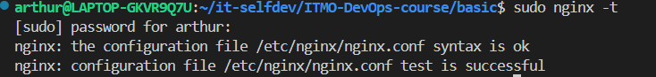
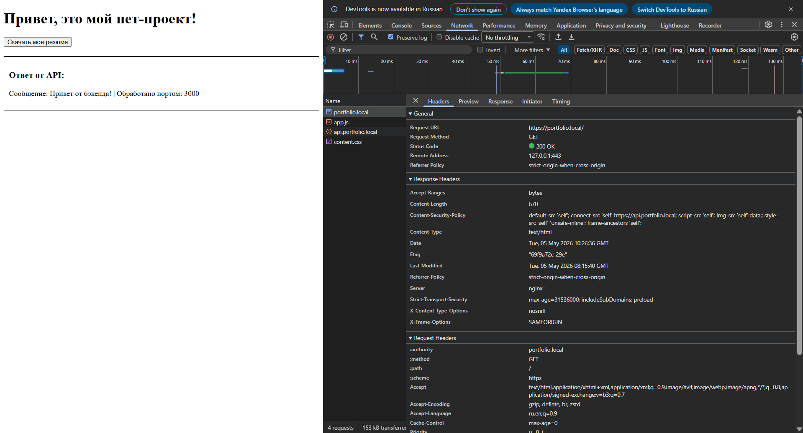
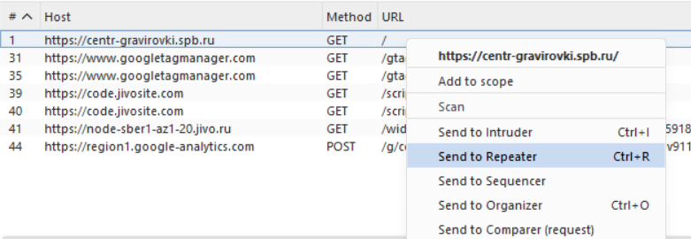
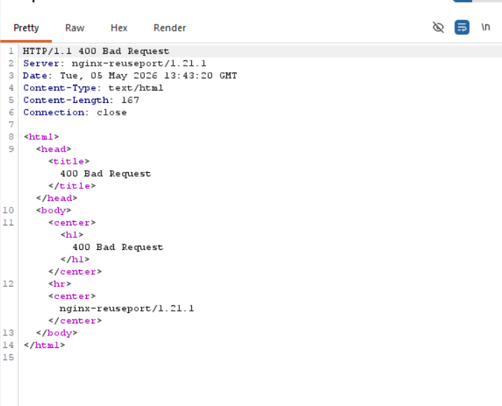
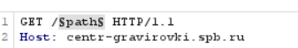
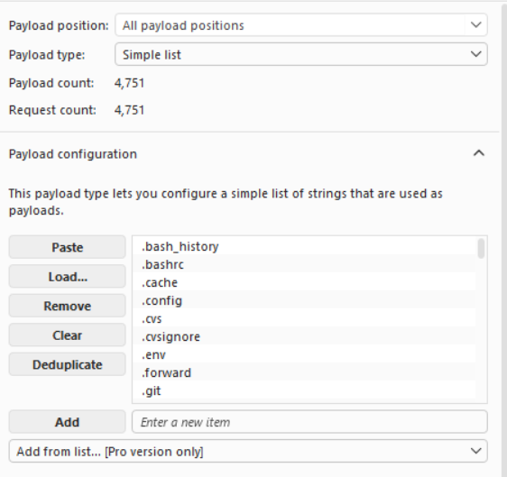
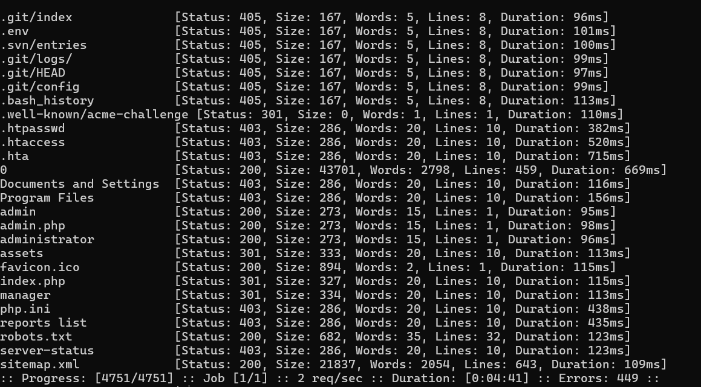
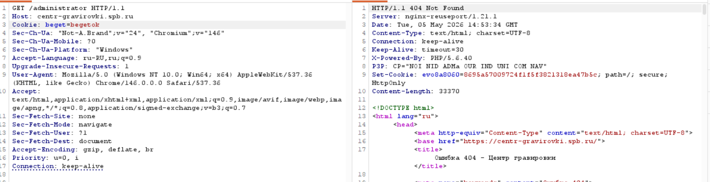
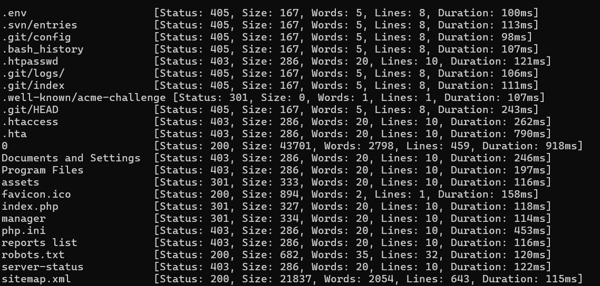

# Лабораторная №3

## Часть 1

К этой лабе подход тот же, просим нейронку придумать проект, чтобы пощупать побольше возможностей nginx.

### Приложение 

Очень кратко, сайт-визитка с апишкой. Используемые фичи:
- Виртуальные хосты
- HTTPS и редиректы
- Reverse Proxy и Балансировка
- Кэширование
- Безопасность
- Управление путями
- Логирование 


### Шаг 0: Установка
Устанавливаем по крутому из официального репозитория с проверкой ключа:
```shell
sudo apt install curl gnupg2 ca-certificates lsb-release ubuntu-keyring

curl https://nginx.org/keys/nginx_signing.key | gpg --dearmor \
    | sudo tee /usr/share/keyrings/nginx-archive-keyring.gpg >/dev/null

gpg --dry-run --quiet --no-keyring --import --import-options import-show /usr/share/keyrings/nginx-archive-keyring.gpg | grep 573BFD6B3D8FBC641079A6ABABF5BD827BD9BF62

echo "deb [signed-by=/usr/share/keyrings/nginx-archive-keyring.gpg] \
https://nginx.org/packages/ubuntu `lsb_release -cs` nginx" \
    | sudo tee /etc/apt/sources.list.d/nginx.list

echo -e "Package: *\nPin: origin nginx.org\nPin: release o=nginx\nPin-Priority: 900\n" \
    | sudo tee /etc/apt/preferences.d/99nginx

sudo apt update
sudo apt install nginx
```

### Шаг 1: Проект и настройка путей
Чтобы удобно работать с файлами из VS Code сделаем следующее:
1. Создаем бэкап исходного конфига, а вместо него создаем ссылку на файл в нашей директории
```bash
sudo mv /etc/nginx/nginx.conf /etc/nginx/nginx.conf.backup
sudo ln -s /home/arthur/it-selfdev/ITMO-DevOps-course/basic/lab3/part-1/nginx.conf /etc/nginx/nginx.conf
```
2. В начале конфигурационного файла записываем `user arthur;`, чтобы у процесса был доступ к файлам директории.


### Шаг 2: Настройка переадресации
> Пока что комментируем базовые настройки
Создаем контекст директиву http, в её контексте - server. Это будет наш первый виртуальный дефолтный сервер для порта 80, который редиректит на https по тому же URL
```nginx
    server {
        listen 80 default_server;
        server_name _;
        return 301 https://$host$request_uri;
        }
```

### Шаг 3.1: Создание SSL сертификата и настройка HTTPS
Так как мы работаем на локалке, воспользуемся утилитой openssl. И так как у нас несколько доменов, настроим SAN (Subject Alternative Name).
```bash
sudo mkdir -p /etc/ssl/private /etc/ssl/certs
sudo openssl req -x509 -nodes -days 365 -newkey rsa:2048 -keyout /etc/ssl/private/nginx-selfsigned.key -out /etc/ssl/certs/nginx-selfsigned.crt -addext "subjectAltName=DNS:portfolio.local,DNS:api.portfolio.local"
```

Далее настраиваем https:
```nginx
http{
    ssl_certificate     /etc/ssl/certs/nginx-selfsigned.crt;
    ssl_certificate_key /etc/ssl/private/nginx-selfsigned.key;

    server {
        listen 443 ssl;
        ...
    }
}
```

### Шаг 3.2: Оптимизация HTTPS
SSL handshake достаточно ресурсозатратная операция, поэтому давайте оптимизируем её с помощью использования постоянных соединений (по умолчанию активно, но пропишем явно) и сохранения параметров SSL-сессии.
```nginx
http {
    ssl_certificate     /etc/ssl/certs/nginx-selfsigned.crt;
    ssl_certificate_key /etc/ssl/private/nginx-selfsigned.key;

    ssl_session_cache   shared:SSL:10m;
    ssl_session_timeout 10m;

    keepalive_timeout 75s

}
```

Эти настройки будут применятся ко всем создаваемым далее серверам.

### Шаг 4.1: frontend

Чёт всё запутано. Но вроде, так как у нас один файл index.html, сделаем вот так:
```nginx
    server {
        listen 443 ssl;
        http2 on;
        server_name portfolio.local;

        root /home/arthur/it-selfdev/ITMO-DevOps-course/basic/lab3/part-1/frontend; 

        location / {
            try_files $uri /index.html;
        }

    }
```
Также здесь мы указываем использовать http2

### Шаг 4.2: Documents and alias
А теперь настроим отдачу файлов по пути /cv/
```nginx
    server {
        listen 443 ssl;
        http2 on;
        server_name portfolio.local;

        root /home/arthur/it-selfdev/ITMO-DevOps-course/basic/lab3/part-1/frontend; 

        location / {
            try_files $uri /index.html;
        }

        location /cv/ {
            alias /home/arthur/it-selfdev/ITMO-DevOps-course/basic/lab3/part-1/documents/;
            add_header Content-Disposition 'attachment';
        }
    }
```

### Шаг 5.1: API server

Тут мы создаем что-то похожее на load balancing и распределение нагрузки и перенаправляем запросы на API.

```nginx
http {
    upstream backend_api {
        server 127.0.0.1:3000;
        server 127.0.0.1:3001;
    }
    server {
        listen 443 ssl;
        server_name api.portfolio.local;

        location / {

            proxy_pass http://backend_api;
            
        }
    }
}
```


### Шаг 5.2: Кэширование
Так как мы не работаем с персональными данными, динамикой, а данные не меняются в случайный момент, может без танцев с бубном включить кэширование, где:
- levels - параметр дробления кэша по папкам
- keys_zone - область из оперативной памяти, которая хранит метаданные: ключи запросов, их статус и тд.
- inactive=60m - время после которого кэш удаляется
- use_temp_path=off - создание временных файлов в той же директории
- proxy_cache_valid 200 10s - время, в течении которого кэш считается свежим и может использоваться вместо запроса на бэк
- proxy_cache_use_stale - при определенном поведении можно вернуть значение из кэша
- proxy_cache_lock on - если одновременно приходят идентичные запросы, то выполняется один, а другие ждут, чтобы взять значение из кэша

```nginx
http {
    proxy_cache_path /var/cache/nginx levels=1:2 keys_zone=api_cache:10m max_size=1g inactive=60m use_temp_path=off;

    upstream backend_api {
        server 127.0.0.1:3000;
        server 127.0.0.1:3001;
    }

    server {
        listen 443 ssl;
        server_name api.portfolio.local;

        location / {
        
            if ($request_method = 'OPTIONS') { 
                return 204; 
            }

            proxy_pass http://backend_api;

            proxy_cache api_cache;
            proxy_cache_valid 200 10s;
            proxy_cache_use_stale error timeout updating http_500 http_502 http_503 http_504; 
            proxy_cache_lock on;

            
        }
    }
}
```


### Шаг 6: Сжатие
Сжатие позволяет уменьшить размер передаваемых данных в 2 и более раз. При этом чувствительные данные вроде CSRF-токенов становятся подвержены атакам вроде [BREACH](https://en.wikipedia.org/wiki/BREACH), но у нас вообще никакой безопасности пока нет, так что воспользуемся.
```nginx
http {
    gzip on;
    gzip_types text/plain text/css application/json application/javascript;
}
```

### Шаг 7: Логирование
Логирование
```nginx
    log_format json_combined escape=json
    '{"time":"$time_local", "ip":"$remote_addr", "request":"$request", '
    '"status":"$status", "req_time":"$request_time", "up_time":"$upstream_response_time"}';
    
    access_log /home/arthur/it-selfdev/ITMO-DevOps-course/basic/lab3/part-1/log/access.json json_combined;
```

### Шаг 8: Безопасность 
1. Добавим атрибуты `server_tokens off`, чтобы скрыть версию веб-сервера и усложнить поиск эксплойтов.
2. Запрет доступа к скрытым файлам:
```nginx
http {
    server {
        location ~ /\.(?!well-known).* {
            deny all;
            access_log off;
            log_not_found off;
        }
    }
}
```
3. Защита от DoS/DDoS:
```nginx
http {
    limit_req_zone $binary_remote_addr zone=mylimit:10m rate=10r/s;
    limit_conn_zone $binary_remote_addr zone=addr:10m;

    server {
        location / {
            limit_req zone=mylimit burst=20 nodelay;
            limit_conn addr 15;

        } 
    }
}
```
4. Защита от XSS и Clickjacking:
> раньше для защиты от Clickjacking использовался X-Frame-Options: SAMEORIGIN, но сейчас, видимо, это встроено в CSP. Но добавим оба для обратной совместимости:
```nginx
http {
    server {
        add_header X-Frame-Options "SAMEORIGIN" always;

        add_header Content-Security-Policy "default-src 'self'; script-src 'self'; img-src 'self' data:; style-src 'self' 'unsafe-inline';frame-ancestors 'self';" always;
    }
}
```

5. И другие важные HTTP заголовки:
```nginx
http {
    server {
        # Prevent MIME type sniffing
        add_header X-Content-Type-Options "nosniff" always;

        # Force HTTPS for 1 year (переадресация всё равно нужна для первого запроса)
        add_header Strict-Transport-Security "max-age=31536000; includeSubDomains; preload" always;

        # Control referrer information
        add_header Referrer-Policy "strict-origin-when-cross-origin" always;  
    }
}
```


### Шаг 9: Запуск
Проверяем конфиг, запускам бэкенд на портах, перезапускам nginx тестим:
```bash
sudo nginx -t

node ~/projects/lab3/backend/server.js 3000
node ~/projects/lab3/backend/server.js 3001
nginx -s reload
```




И всё даже работает.


## Часть 2

Будет взламывать сайт https://centr-gravirovki.spb.ru/ 

### Path Traversal
Раньше не работал с Burp Suite, но почему бы не познакомится с инструментом сейчас?
Открываем сайт во встроенном браузере, находим в истории GET запрос и кидаем в repeater


Разные комбинации запросов "в лоб"
```
GET /../../../../../../etc/passwd
GET /assets/galleries/%252e%252e%252f/etc/passwd
GET /assets/galleries/%2e%2e/%2e%2e/%2e%2e/etc/passwd
GET /assets/galleries/../../
GET /assets/../../../../
GET /assets/%2e%2e/%2e%2e/
```

Возвращали либо ничего, либо ошибку 400

### Перебор страниц
Тоже попробуем сделать в burp


Загружаем файлик [common.txt](https://github.com/danielmiessler/SecLists/blob/master/Discovery/Web-Content/common.txt)


И запускаем перебор.

Процесс шёл довольно медленно, поэтому давай всё-таки через ffuf:

Интересный ответ выдаёт curl https://centr-gravirovki.spb.ru/administrator
```
<html><head><script>function set_cookie(){var now = new Date();var time = now.getTime();time += 19360000 * 1000;now.setTime(time);document.cookie='beget=begetok'+'; expires='+now.toGMTString()+'; path=/';}set_cookie();location.reload();;</script></head><body></body></html>
```
Это похоже на антибот защиту, но если попробовать её обойти, то окажется что сервиса не существует.


### Перебор страниц 2
Посчитаем за отдельную попытку перебор с заголовком beget=begetok:


Но тут уже ничего найти не удалось. Как итог, кроме robot.txt и sitemap.xml мы ничего не нашли

# Вместо вывода
Во-первых, я [настроил](https://code.visualstudio.com/docs/languages/markdown#_inserting-images-and-links-to-files) чтобы при вставке картинки автоматически падали в директорию images. И я очень рад.
Во-вторых, как-то слишком много усилий для сайта, который печатает "Привет от бэкенда", ахах
В-третьих, вторую часть со "взломом" уделили на так много внимания, но базовые уязвимости проверил 


# Источники
- https://nginx.org/ru/linux_packages.html
- https://nginx.org/ru/docs/http/configuring_https_servers.html
- https://reintech.io/blog/nginx-server-security-best-practices
- https://www.linode.com/docs/guides/getting-started-with-nginx-part-4-tls-deployment-best-practices/
- https://nginx.org/ru/docs/http/ngx_http_v2_module.html
- https://nginx.org/ru/docs/http/ngx_http_gzip_module.html
- https://nginx.org/ru/docs/http/ngx_http_core_module.html
- https://nginx.org/ru/docs/http/ngx_http_limit_req_module.html