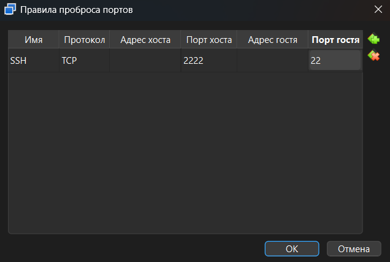

# Лабораторная №4

Начав обозревать тему CI\CD, создалось ощущение, что она является наиболее объёмной из курса, так как пайплайн может значительно отличаться в зависимости от принятых в компании практик, бизнес-процессов, методологий, архитектуры самого продукта и тд. 

> Но и в этот раз сделаю качественно и по красоте.

## Часть 1

> Для настройки CI\CD использовался GitHub Actions

### Приложение 

Для тестов возьмем проект из ЛР№2 - небольшой сайт для голосования, с настроенным HELM'ом, однако будем использовать k3s так как minikube потребляет больше ресурсов и не подходит для запуска в VM. Работа будет реализована на VM Ubuntu-server 24.04.

### Pipeline

Для симуляции работы CI\CD создадим два окружения: test и prod, где деплой во второе будет требовать подтверждения. Окружения будем разделять по namespace в helm и поддомену test. Раннер будет запущен локально

> Написать про этапы

### Шаг 0: Настройка VM
Для проекта было выделено 7 Гб RAM и 6 ядер ЦПУ, настройка выполнялась автоматически. Для удобства работы настроим подключение по SSH, для этого пробросим 22 порт в настройках VM (Расширенные -> Сеть -> Проброс портов -> Добавить новое правило)


Теперь к VM можно подключиться командой
```bash
ssh -p 2222 username@127.0.0.1
```

### Шаг 1.1: Установка зависимостей
#### Docker
```bash
# Add Docker's official GPG key:
sudo apt update
sudo apt install ca-certificates curl
sudo install -m 0755 -d /etc/apt/keyrings
sudo curl -fsSL https://download.docker.com/linux/ubuntu/gpg -o /etc/apt/keyrings/docker.asc
sudo chmod a+r /etc/apt/keyrings/docker.asc

# Add the repository to Apt sources:
sudo tee /etc/apt/sources.list.d/docker.sources <<EOF
Types: deb
URIs: https://download.docker.com/linux/ubuntu
Suites: $(. /etc/os-release && echo "${UBUNTU_CODENAME:-$VERSION_CODENAME}")
Components: stable
Architectures: $(dpkg --print-architecture)
Signed-By: /etc/apt/keyrings/docker.asc
EOF

sudo apt update

sudo apt install docker-ce docker-ce-cli containerd.io docker-buildx-plugin docker-compose-plugin
```

####  k3s
```bash
curl -sfL https://get.k3s.io | sh -
```

### Шаг 1.1: Настройка окружения
#### Пользователь gha
```bash
sudo useradd -m -s /bin/bash gha-runner
sudo passwd gha-runner
```

#### Docker
```bash
sudo usermod -aG docker gha-runner
newgrp docker
```
#### k3s
```bash
sudo -u gha-runner mkdir -p /home/gha-runner/.kube
sudo cp /etc/rancher/k3s/k3s.yaml /home/gha-runner/.kube/config
sudo chown gha-runner:gha-runner /home/gha-runner/.kube/config
sudo chmod 600 /home/gha-runner/.kube/config

export KUBECONFIG=~/.kube/config
kubectl get pods -n test
```


### Шаг 2: Настраиваем self-hosted runner
Переходим Settings -> Actions -> Runners -> New self-hosted runner
Выбираем Linux x64
#### Download
```bash
su - gha-runner

mkdir actions-runner && cd actions-runner
curl -o actions-runner-linux-x64-2.334.0.tar.gz -L https://github.com/actions/runner/releases/download/v2.334.0/actions-runner-linux-x64-2.334.0.tar.gz
echo "048024cd2c848eb6f14d5646d56c13a4def2ae7ee3ad12122bee960c56f3d271  actions-runner-linux-x64-2.334.0.tar.gz" | shasum -a 256 -c
tar xzf ./actions-runner-linux-x64-2.334.0.tar.gz
```
#### Configure
```bash
./config.sh --url https://github.com/code-minister/it-selfdev --token A7YMG7G4Y25NQEZQPF6Y35DKCRN4W
./run.sh
```
#### Автоперезапуск 
```bash
su -
cd /home/gha-runner/actions-runner/

./svc.sh install
./svc.sh start
```


### Шаг 3.1: Создание bed-ci-cd
```yaml
name: bad-ci-cd

on: push

permissions: write-all

env:
  DOCKERHUB_USERNAME: ${{ secrets.DOCKERHUB_USERNAME }}
  DOCKERHUB_TOKEN: ${{ secrets.DOCKERHUB_TOKEN }}
  IMAGE_TAG: latest

jobs:
  build_deploy:
    runs-on: self-hosted
    steps:
      - uses: actions/checkout@master
      - uses: actions/setup-python@v5
      - name: Run tests
        continue-on-error: true
        run: |
          echo "Running backend tests"
          echo "Running frontend tests"
          echo "Running worker tests"
      - name: Lint (placeholder)
        run: |
          echo "Running lint (placeholder)"
      - name: Security scan (placeholder)
        run: |
          echo "Running security scan (placeholder)"
      - name: Docker login
        run: |
          docker login -u "${DOCKERHUB_USERNAME}" -p "${DOCKERHUB_TOKEN}"
      - name: Build and push backend
        run: |
          docker build --no-cache -t "${DOCKERHUB_USERNAME}/voting-backend:${IMAGE_TAG}" lab4/voting-app/services/backend
          docker push "${DOCKERHUB_USERNAME}/voting-backend:${IMAGE_TAG}"
      - name: Build and push frontend
        run: |
          docker build --no-cache -t "${DOCKERHUB_USERNAME}/voting-frontend:${IMAGE_TAG}" lab4/voting-app/services/frontend
          docker push "${DOCKERHUB_USERNAME}/voting-frontend:${IMAGE_TAG}"
      - name: Build and push worker
        run: |
          docker build --no-cache -t "${DOCKERHUB_USERNAME}/voting-worker:${IMAGE_TAG}" lab4/voting-app/services/worker
          docker push "${DOCKERHUB_USERNAME}/voting-worker:${IMAGE_TAG}"
      - name: Deploy straight to production
        env:
          KUBECONFIG: /home/gha-runner/.kube/config
        run: |
          sudo helm upgrade --install voting-app lab4/voting-app/helm \
            --namespace default \
            --set backend.image.repository="${DOCKERHUB_USERNAME}/voting-backend" \
            --set backend.image.tag="${IMAGE_TAG}" \
            --set frontend.image.repository="${DOCKERHUB_USERNAME}/voting-frontend" \
            --set frontend.image.tag="${IMAGE_TAG}" \
            --set worker.image.repository="${DOCKERHUB_USERNAME}/voting-worker" \
            --set worker.image.tag="${IMAGE_TAG}"

```


### Шаг 3.2: Создание good-ci-cd
```yaml 
name: good-ci-cd

on:
  push:
    paths:
      - "lab4/voting-app/services/**"
  pull_request:
    paths:
      - "lab4/voting-app/services/**"

permissions:
  contents: read

concurrency:
  group: ci-cd-${{ github.ref }}
  cancel-in-progress: false

env:
  DOCKERHUB_USERNAME: ${{ secrets.DOCKERHUB_USERNAME }}
  IMAGE_TAG: ${{ github.sha }}

jobs:
  test:
    runs-on: self-hosted
    timeout-minutes: 10
    steps:
      - uses: actions/checkout@v4
      - uses: actions/setup-python@v5
        with:
          python-version: "3.11"
          cache: "pip"
          cache-dependency-path: |
            lab4/voting-app/services/backend/requirements.txt
            lab4/voting-app/services/frontend/requirements.txt
            lab4/voting-app/services/worker/requirements.txt
      - name: Install dependencies and run tests
        shell: bash
        run: |
          services=(backend frontend worker)
          for svc in "${services[@]}"; do
            echo "==> ${svc}"
            echo "Running tests for ${svc} (placeholder)"
          done

  lint:
    runs-on: self-hosted
    timeout-minutes: 5
    steps:
      - uses: actions/checkout@v4
      - name: Lint (placeholder)
        run: |
          echo "Running lint (placeholder)"

  security_scan:
    runs-on: self-hosted
    timeout-minutes: 10
    steps:
      - uses: actions/checkout@v4
      - name: Security scan (placeholder)
        run: |
          echo "Running security scan (placeholder)"

  build_and_push:
    runs-on: self-hosted
    timeout-minutes: 30
    needs:
      - test
      - lint
      - security_scan
    if: github.event_name == 'push'
    steps:
      - uses: actions/checkout@v4
      - uses: docker/setup-buildx-action@v3
      - uses: docker/login-action@v3
        with:
          username: ${{ secrets.DOCKERHUB_USERNAME }}
          password: ${{ secrets.DOCKERHUB_TOKEN }}
      - name: Build and push backend
        uses: docker/build-push-action@v6
        with:
          context: lab4/voting-app/services/backend
          push: true
          tags: ${{ env.DOCKERHUB_USERNAME }}/voting-backend:${{ env.IMAGE_TAG }}
          cache-from: type=gha
          cache-to: type=gha,mode=max
      - name: Build and push frontend
        uses: docker/build-push-action@v6
        with:
          context: lab4/voting-app/services/frontend
          push: true
          tags: ${{ env.DOCKERHUB_USERNAME }}/voting-frontend:${{ env.IMAGE_TAG }}
          cache-from: type=gha
          cache-to: type=gha,mode=max
      - name: Build and push worker
        uses: docker/build-push-action@v6
        with:
          context: lab4/voting-app/services/worker
          push: true
          tags: ${{ env.DOCKERHUB_USERNAME }}/voting-worker:${{ env.IMAGE_TAG }}
          cache-from: type=gha
          cache-to: type=gha,mode=max

  deploy_test:
    runs-on: self-hosted
    timeout-minutes: 15
    needs: build_and_push
    if: github.event_name == 'push'
    environment: test
    steps:
      - uses: actions/checkout@v4
      - uses: azure/setup-helm@v4
      - name: Deploy to test
        env:
          KUBECONFIG: /home/gha-runner/.kube/config
        run: |
          helm upgrade --install voting-app lab4/voting-app/helm \
            --namespace test \
            --create-namespace \
            --atomic \
            --wait \
            --timeout 5m \
            --set backend.image.repository="${DOCKERHUB_USERNAME}/voting-backend" \
            --set backend.image.tag="${IMAGE_TAG}" \
            --set frontend.image.repository="${DOCKERHUB_USERNAME}/voting-frontend" \
            --set frontend.image.tag="${IMAGE_TAG}" \
            --set worker.image.repository="${DOCKERHUB_USERNAME}/voting-worker" \
            --set worker.image.tag="${IMAGE_TAG}"

  deploy_prod:
    runs-on: self-hosted
    needs: deploy_test
    if: github.event_name == 'push'
    environment: production
    steps:
      - uses: actions/checkout@v4
      - uses: azure/setup-helm@v4
      - name: Deploy to production
        env:
          KUBECONFIG: /home/gha-runner/.kube/config
        run: |
          helm upgrade --install voting-app lab4/voting-app/helm \
            --namespace prod \
            --create-namespace \
            --atomic \
            --wait \
            --timeout 5m \
            --set backend.image.repository="${DOCKERHUB_USERNAME}/voting-backend" \
            --set backend.image.tag="${IMAGE_TAG}" \
            --set frontend.image.repository="${DOCKERHUB_USERNAME}/voting-frontend" \
            --set frontend.image.tag="${IMAGE_TAG}" \
            --set worker.image.repository="${DOCKERHUB_USERNAME}/voting-worker" \
            --set worker.image.tag="${IMAGE_TAG}"
```

### Шаг 3.3: Описание практик

#### 1. Использование нестабильных версий
BAD
```
IMAGE_TAG: latest
...
uses: actions/checkout@master
```

GOOD
```
uses: actions/checkout@v4
...
set backend.image.tag="${IMAGE_TAG}
set frontend.image.tag="${IMAGE_TAG}
```

Это предотвращает падение прода если новая версия ресурса окажется несовместима с проектом.


#### 2. Ненужные срабатывания (слишком общий триггер)
BAD
```
on: push
```

GOOD
```
on:
  push:
    paths:
      - "lab4/voting-app/services/**"
  pull_request:
    paths:
      - "lab4/voting-app/services/**"
```


Лишние срабатывания нагружают системы, используют ресурсы, усложняют логику и могут привести к ошибкам.
#### 3. Монолитная джоба


BAD
```
jobs:
  build_deploy:
    steps:
      name: Run tests but ignore failures
      name: Lint
      name: Security scan
      name: Docker login
      name: Build and push backend
      name: Build and push frontend
      name: Build and push worker
      name: Deploy straight to production
```

GOOD
```
jobs:
  test:
  build_and_push:
  deploy_test:
  deploy_prod:
```

Разделение логики помогает более явно показать логику, упрощает поиск ошибок и не выполнять лишние шаги.


#### 4. Игнорирование тестов
BAD
```
continue-on-error: true
```

GOOD
```
...
```

Иногда тесты игнорируются вследствие:
1. нестабильных результатов (то зеленый, то красный по неизвестной причине, такие называются Flaky Tests)
2. Legacy кода
3. Необходимости хотфиксов
4. Горящих дедлайнов

Если не решить проблему должным образом и не убрать игнорирование, это может привести к негативным последствиям.


#### 5. Отсутствие тестового окружения 
BAD
```
...
```

GOOD
```
deploy_test:
  ...
```

Строго говоря это не является best practices, но почти всегда наличие тестового окружения помогает выявить ошибки до запуска в прод даже для малых проектов. Также деплой в "прод" требует ручного подтверждения
  
Да, я считаю это киллер фича моей лабы

#### 6.Избыток или отсутствие параллелизма
BAD
```
...
```

GOOD
```
jobs:
  test:
  lint:
  security_scan:
  build_and_push:
    needs:
        - test
        - lint
        - security_scan
  deploy_test:
    needs: deploy_test
```


Зависимость между джобами, то есть их линейный порядок, помогает не тратить ресурсы на сборку модулей, которые не прошли тесты. Также это создает условие для [Fail fast](https://about.gitlab.com/blog/how-to-keep-up-with-ci-cd-best-practices/), что позволяет быстрее исправлять ошибки. Однако малозатратные джобы можно запускать параллельно для ускорения выполнения.


#### 7. Отсутствие кэширование 
BAD
```
- name: Run tests
  run: 
  ...

```

GOOD
```
test:
  steps:
    with:
      python-version: "3.11"
      cache: "pip"
      cache-dependency-path: |
        lab4/voting-app/services/backend/requirements.txt
        lab4/voting-app/services/frontend/requirements.txt
        lab4/voting-app/services/worker/requirements.txt
```


#### 8. Отсутствие ограничения по времени.
BAD
```
...
```

GOOD
```
timeout-minutes: 10
timeout-minutes: 15
...
```

Если какой-то этап выполняется дольше, чем ожидается или вовсе зависает, это также указывается на проблему 


### Шаг 3.4 Дополнительные практики
В этом блоке я решил написать про bad practices, которые полезно упомянуть, но которые у меня не представлены или не исправлены.


#### 1. Хардкод секретов, печать их в логах
Тут всё очевидно, не нужно пушить пароли от БД и сид-фразу от криптокошелька в гит.  
Используем .env файлы, GitHub secrets, Hashicorp Vault.


#### 2. Наличие некачественных тестов
Сюда относятся как раз:
1. Flaky Tests
2. Устаревшие тесты
3. Тесты, зависящие от других тестов
4. Слишком медленные тесты
5. Brittle Tests - хрупкие тесты, проверяющие реализацию, а не поведение (например, что кнопка имеет синий цвет)


#### 3. OverEngineering 
Это моя любимая практика.   
Подразумевает создания продукта, системы или решения, которые являются более сложными, чем необходимо для выполнения поставленных задач.  
Это увеличивает time to market, continuous improvement cycle и денежные расходы.


#### 4. Игнорирования принципа наименьших привилегий
Выдача прав сверх необходимых создаёт брешь в безопасности. Запуск с sudo, права токенов и тд.


### Шаг 4: Тест


# Источники
- https://docs.docker.com/engine/install/ubuntu/
- https://docs.github.com/en/actions/how-tos/manage-runners/self-hosted-runners/add-runners
- https://about.gitlab.com/blog/how-to-keep-up-with-ci-cd-best-practices/
- 