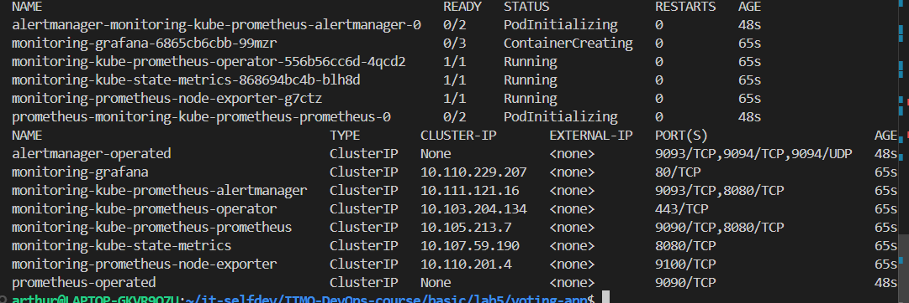
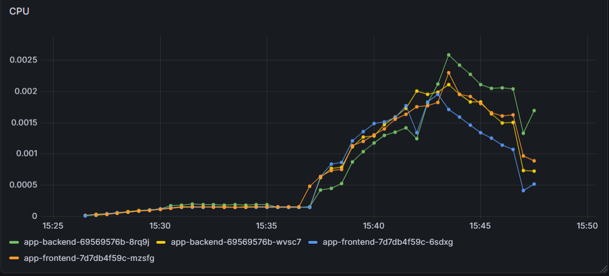
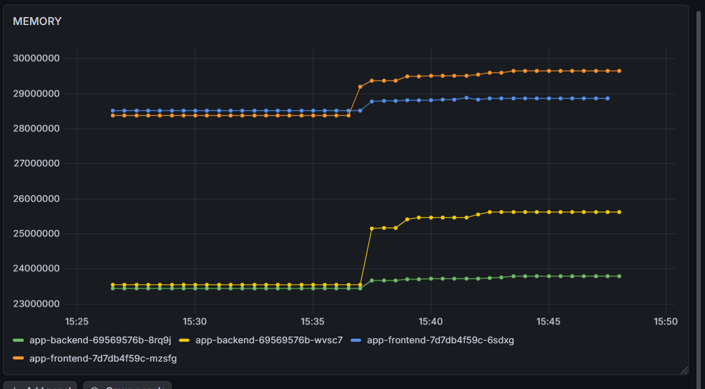

# Лабораторная №5

## Часть 1

### Приложение
Возьмем уже знакомый проект с голосовалкой

### Шаг 1: Деплой приложения в Kubernetes
Переходим в директорию с chart'ом и устанавливаем релиз:
```bash
helm install my-voting-release ./voting-app/helm -n prod --create-namespace
```

Проверяем, что всё поднялось:
```bash
kubectl get pods -n prod
kubectl get svc -n prod
```

### Шаг 2: Установка Prometheus + Grafana
Устанавливаем готовый стек мониторинга (Prometheus, Grafana, node-exporter, kube-state-metrics и т.д.):
```bash
helm repo add prometheus-community https://prometheus-community.github.io/helm-charts
helm repo update

helm upgrade --install monitoring prometheus-community/kube-prometheus-stack \
  -n monitoring --create-namespace
```

Проверяем, что все компоненты в namespace `monitoring` в статусе Running:
```bash
kubectl get pods -n monitoring
kubectl get svc -n monitoring
```


### Шаг 3: Доступ к Grafana
Получаем пароль администратора (логин всегда `admin`):
```bash
kubectl -n monitoring get secret monitoring-grafana \
  -o jsonpath="{.data.admin-password}" | base64 -d ; echo
```

Пробрасываем порт, чтобы открыть Grafana локально:
```bash
kubectl -n monitoring port-forward svc/monitoring-grafana 3000:80
```
Открываем в браузере: `http://localhost:3000`.


### Шаг 4: Графики (2 рабочих метрики)

Для отчёта сделаем два графика:
1. CPU (нагрузка) для backend/frontend
2. Memory (память) для backend/frontend


#### 4.1 CPU (cores) — backend vs frontend
```promql
sum by (pod) (
  rate(container_cpu_usage_seconds_total{
    namespace="prod",
    pod=~"app-backend-.*|app-frontend-.*",
    cpu="total"
  }[5m])
)
```

#### 4.2 Memory (bytes) — backend vs frontend
```promql
sum by (pod) (
  container_memory_working_set_bytes{
    namespace="prod",
    pod=~"app-backend-.*|app-frontend-.*"
  }
)
```

### Итоговые графики:


